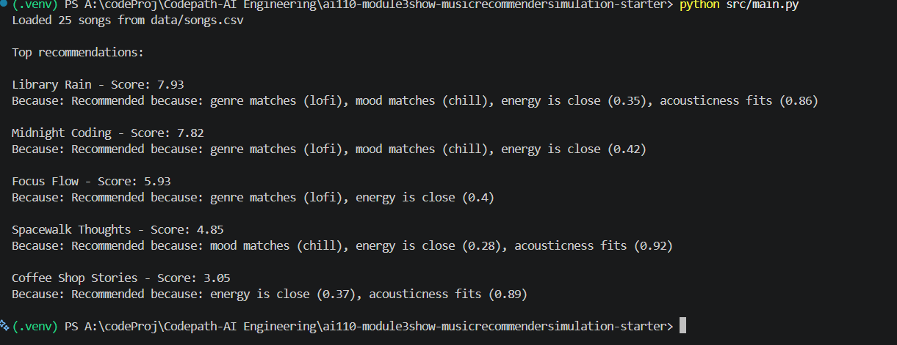
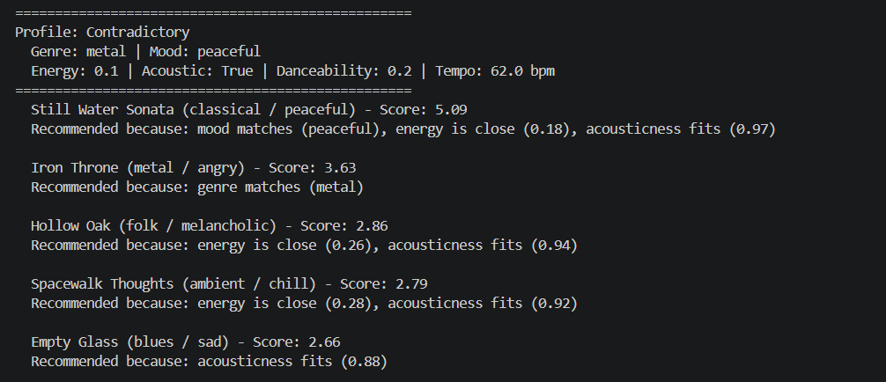
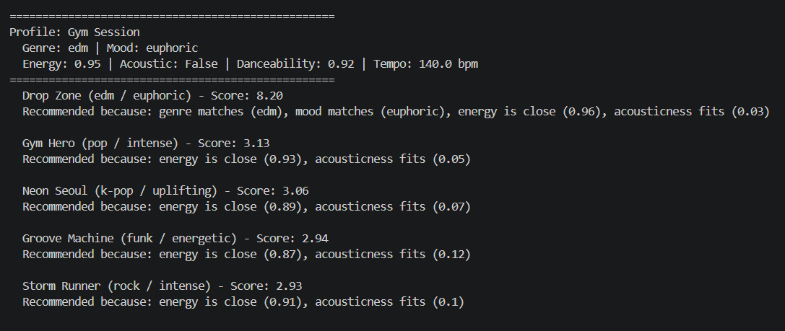
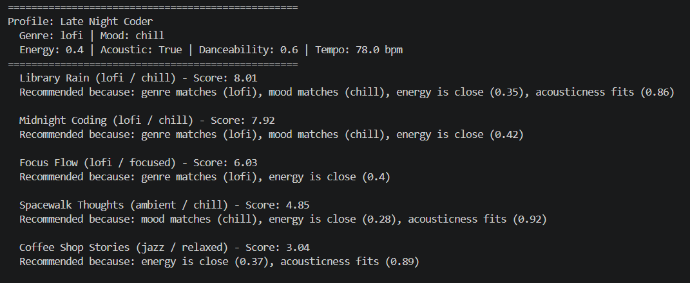
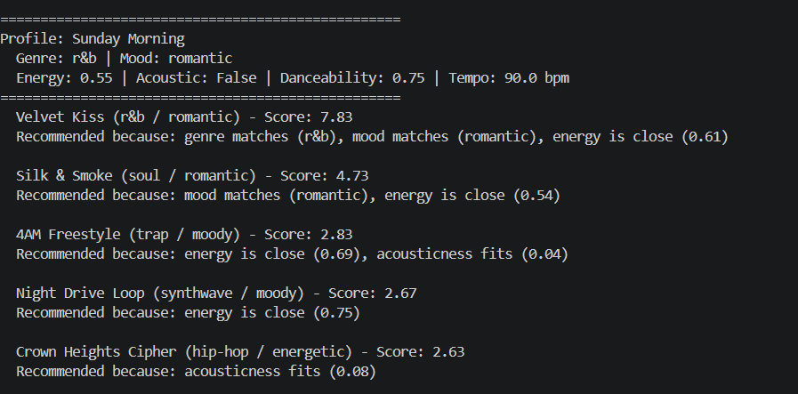

# 🎵 Music Recommender Simulation

## Project Summary

In this project you will build and explain a small music recommender system.

Your goal is to:

- Represent songs and a user "taste profile" as data
- Design a scoring rule that turns that data into recommendations
- Evaluate what your system gets right and wrong
- Reflect on how this mirrors real world AI recommenders

Replace this paragraph with your own summary of what your version does.

---

## How The System Works

Explain your design in plain language.

write a short paragraph explaining your understanding of how real-world recommendations work and what your version will prioritize

In the real world, a recommender system makes its decisions based on mostly 2 factors, what people with similar tastes choose (Collaborative Filtering), or what songs are similar to songs that the user already likes (Content-Based Filtering).
Since my version is lacking users, I will be more focused on Content-Based Filtering, i.e picking song recommendations based on similar attributes.
My `Song` class will primarily use genre, mood, energy, acousticness, tempo_bpm, and my `UserProfile` class uses favorite genre, favorite_mood, target_energy, likes_acoustic.
The recommender will compute recommendability scores, based on similarities to previously liked songs based on our aforementioned `Song` features

### Algorithmic Flow Chart

```
  flowchart TD
    A([User Preferences\ngenre: lofi · mood: chill\nenergy: 0.4 · likes_acoustic: true]) --> B

    B[Load songs from\ndata/songs.csv] --> C

    C{For each song\nin catalog}

    C --> D1[Score: genre match\n× 3.0]
    C --> D2[Score: mood match\n× 2.0]
    C --> D3[Score: energy closeness\n× 1.5]
    C --> D4[Score: acousticness closeness\n× 1.0]
    C --> D5[Score: danceability closeness\n× 0.5]
    C --> D6[Score: tempo closeness\n× 0.25]

    D1 & D2 & D3 & D4 & D5 & D6 --> E

    E[Sum all weighted scores\nmax possible = 8.25]

    E --> F{More songs\nremaining?}

    F -- Yes --> C
    F -- No --> G

    G[Sort all songs\nby score descending]

    G --> H[Slice top k results\nk = 5]

    H --> I([Output Recommendations\ntitle · score · explanation])
```

### Potential Biases

There is a heavy bias towards genre and mood, which might miss out on sleeper picks based on other matching categories.



### Other Run throughs

#### Contradictory 


#### Gym Session


#### Late Night Choir


#### Sunday Morning 

---

## Getting Started

### Setup

1. Create a virtual environment (optional but recommended):

   ```bash
   python -m venv .venv
   source .venv/bin/activate      # Mac or Linux
   .venv\Scripts\activate         # Windows

2. Install dependencies

```bash
pip install -r requirements.txt
```

3. Run the app:

```bash
python -m src.main
```

### Running Tests

Run the starter tests with:

```bash
pytest
```

You can add more tests in `tests/test_recommender.py`.

---

## Experiments You Tried

**Experiment 1 — Genre weight reduced from 3.0 to 0.5 (Late Night Coder profile)**

With the default weight of 3.0, the top 3 results for the Late Night Coder profile were all lofi songs: Library Rain (8.01), Midnight Coding (7.92), and Focus Flow (6.03). Spacewalk Thoughts (ambient/chill) sat at rank 4 with a score of 4.85.

After lowering genre weight to 0.5, Spacewalk Thoughts jumped to rank 3 (4.85), pushing Focus Flow down to rank 4 (3.53). This happened because Spacewalk Thoughts has very similar energy (0.28) and acousticness (0.92) to the lofi songs, and mood matched (chill) — so with genre no longer dominating, its numeric features were enough to beat a lofi song that only partially matched on mood. The takeaway: genre weight is the primary guard against cross-genre drift. Weakening it lets acoustically similar but stylistically different songs sneak in.

---

**Experiment 2 — Energy weight doubled from 1.5 to 3.0 (Contradictory profile)**

With the default weights, the Contradictory profile (metal/peaceful/low energy/acoustic) ranked Iron Throne 2nd (3.63) because genre matched — even though every numeric feature pointed away from it. After doubling the energy weight to 3.0, Iron Throne dropped to rank 4 (3.85 total, but now outweighed by three songs with closer energy values). Still Water Sonata jumped to a score of 6.47, and Hollow Oak and Spacewalk Thoughts both overtook Iron Throne purely on energy and acousticness closeness. This confirmed that the genre match alone (worth 3.0 points) can be overwhelmed when a continuous feature carries enough weight — and that the Contradictory profile's genre preference is actively working against it in this configuration.

---

## Limitations and Risks

- **Tiny catalog:** The system only scores against 25 songs, so even a perfect profile match returns a shallow pool. A user whose preferred genre has only one entry (e.g. blues, bossa nova) will get four recommendations from genres they didn't ask for.
- **No content understanding:** The recommender has no knowledge of lyrics, language, vocal style, or instrumentation detail. Two songs can score identically even if one has screamed vocals and one has soft piano.
- **Genre monopoly:** When genre and mood match multiple songs, those songs dominate all top slots. A lofi user will always see three lofi results with no exposure to adjacent styles like ambient or indie pop.
- **Self-contradictory profiles are not detected:** If a user's preferences conflict internally (e.g. metal genre + peaceful mood + low energy), the system still returns five results with no warning — the top-ranked song wins almost by accident.
- **Static weights:** The scoring weights (3.0, 2.0, 1.5 ...) are fixed by the developer and never adapt to how the user actually behaves. A user who skips every high-energy result will keep receiving them.

---

## Reflection

Building this system made it clear that a recommender is not really about finding the "best" song — it is about turning a user's preferences into a number and then comparing that number across a catalog. Every design decision along the way (which features to include, how much weight each one gets, what counts as a match) is a human judgment call dressed up as math. The scoring formula feels objective once it is running, but the weights are arbitrary choices the developer made, and changing them by even a small amount can completely reorder the results. That gap between "looks like a calculation" and "is actually a set of assumptions" is something real recommendation systems deal with at massive scale.

The place where bias showed up most clearly was in catalog representation. Genres with three songs in the dataset (lofi) had a structural advantage over genres with one (blues, bossa nova) — not because of anything in the scoring logic, but simply because more candidates means more chances for a close numeric match. A real product with this design would quietly under-serve users whose tastes fall outside whatever the team happened to catalog first, without any error or warning to indicate the problem. That made it obvious why fairness in AI is not just about the algorithm — it is equally about whose music, whose moods, and whose listening contexts made it into the data in the first place.


---
